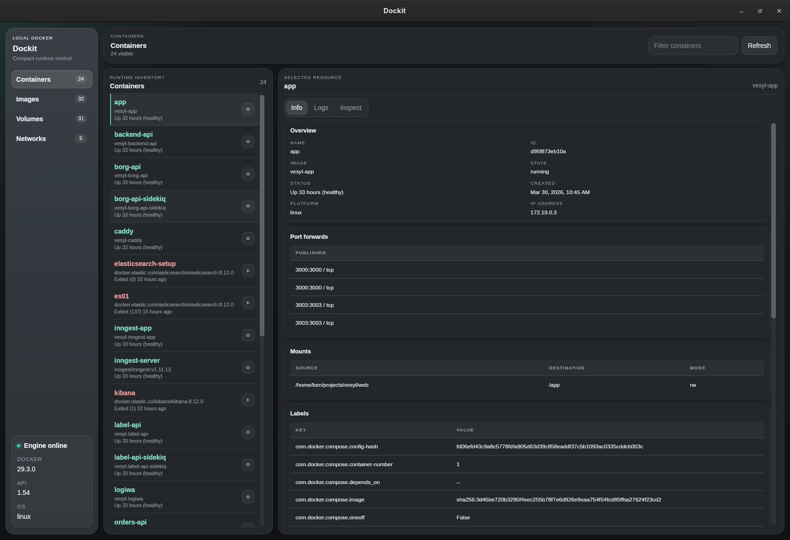

# Dockit

Desktop app built with React, TypeScript, Vite, and Tauri.

## Screenshot



## Download

Prebuilt Linux and macOS binaries are published on the GitHub Releases page:

- [Download the latest release](https://github.com/benwyrosdick/dockit/releases) from `https://github.com/benwyrosdick/dockit/releases`

## Package manager

This repo uses Bun.

## Requirements

- [Bun](https://bun.sh)
- Rust and the Tauri native prerequisites for your platform

## Getting started

```bash
bun install
```

## Development

Run the web app in development mode:

```bash
bun run dev
```

Run the Tauri app:

```bash
bun run tauri dev
```

## Build

Build the frontend bundle:

```bash
bun run build
```

Build the desktop app:

```bash
bun run tauri build
```

Build just the AppImage on a local rolling-release Linux machine:

```bash
bun run build:appimage
```

That script runs the build inside an `ubuntu:22.04` container so AppImage packaging stays compatible even when the host toolchain is newer than `linuxdeploy` expects.

CI also builds an AppImage artifact with `.github/workflows/appimage.yml`.

## Lint

```bash
bun run lint
```
